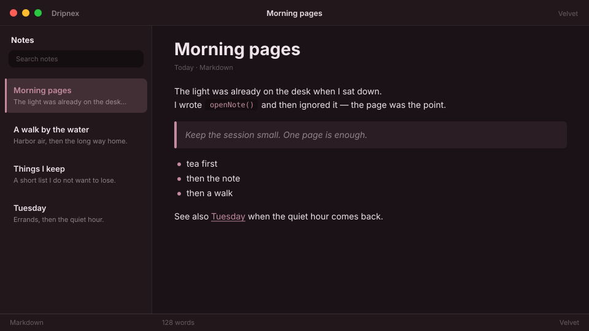

# Velvet

Wine-dark. Dusty rose on mauve ink — soft, not electric.



```
dripnex/theme-velvet
```

## Palette

The chips live in [palette.html](palette.html) — open it in a browser. GitHub won’t paint HTML swatches here, so the hex list is below.

| Name | Token | Color | What it’s for |
| --- | --- | --- | --- |
| Base | `--bg-base` | `#1a1216` | Window background |
| Surface | `--bg-surface` | `#22181c` | Sidebar and chrome |
| Elevated | `--bg-elevated` | `#2c2026` | Raised panels |
| Text | `--text-primary` | `#f0e4ea` | Headings and body |
| Muted | `--text-muted` | `#f0e4ea · rgba(240, 228, 234, 0.52)` | Secondary copy |
| Accent | `--accent` | `#c48b9f` | Selection and links |
| Active | `--status-active` | `#c48b9f` | Active status |
| Dropped | `--status-dropped` | `#b45a6a` | Dropped status |

Pick it when you want wine-dark mauve, not electric violet.
